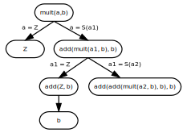
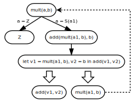

# С чем едят "гомеоморфное вложение"

**18 мая 2009 г.**

При "прогонке" (символическом/обобщённом исполнении программы) в общем
случае получается бесконечное дерево конфигураций. Задача
суперкомпиляции - превратить это дерево в конечный граф.

В заметке [Что такое суперкомпиляция?](01-what-is-scp.md)
был рассмотрено такое простейшее "правило зацикливания". Допустим, в дереве 
встретился такой узел, который содержит конфигурацию `X2`, и при этому среди 
предков этого узла в дереве есть конфигурация `X1`, такая, что `X1` и `X2` 
совпадают (с точностью до переименования переменных). Понятно, что при таких 
условиях нет смысла строить поддерево для `X2`, поскольку оно будет выглядеть 
точно так же, как и поддерево, подвешенное к `X1`.

Поэтому выполнялась следующая операция. К графу добавлялась обратная стрелка из 
`X2` в `X1`, а поддерево, подвешенное к `X2` удалялось из графа. Точнее, оно не 
удалялось, а вообще не строилось!

Вот так и получался конечный граф. Правда, только для некоторых
"особенно хороших" исходных программ.

В заметке [Обобщение конфигураций при суперкомпиляции](02-generalization.md)
рассматривалось более сложное "правило зацикливания". Допустим, что `X2` и `X1` 
- действительно разные (`X1` нельзя превратить в `X2` простым переименованием 
переменных), но `X2` является "частным случаем" `X1`. В том смысле, что применив 
к переменным в `X1` некоторую подстановку, можно превратить `X1` в `X2`. Тогда 
можно преобразовать `X2` таким образом, чтобы она совпала с `X1` (с точностью до 
переименования переменных). Это делается так: выдумываем новые, уникальные имена 
переменных `v1`, ..., `vk` и `X2` приводится к виду

    let v1 = E1,..., vk = Ek in E0

где `E0` уже совпадает с `X1` (с точностью до переименования переменных). На 
следующем шаге, let-выражение разбирается на части `E0`, `E1`,..., `Ek`, каждая 
из которых обрабатывается отдельно. При этом уже можно добавить к графу обратную 
стрелку из `E0` в `X1`.

Переход от `X2` к let-выражению, содержащему `E0`, называется "обобщением", 
поскольку `X2` является "частным случаем" `E0`.

Благодаря обобщению конфигураций, класс программ, для которых получался
конечных граф конфигураций, - расширился.

И способ борьбы с разрастанием дерева - понятен. Если встретилась
конфигурация, которая является частным случаем уже рассмотренной
конфигурации - сводим более специфическую конфигурацию к более общей.
Возникает вопрос: достаточно ли этого правила, чтобы получить конечный
граф конфигураций для любой исходной программы? Ответ на это -
отрицательный... (Видимо, Судьба так распорядилась, чтобы авторам
суперкомпиляторов жизнь мёдом не казалась. :-) )

Рассмотрим следующих (простой - но коварный) пример программы. Определим функцию 
умножения `mult` через уже нам известную функция сложения `add`.

    add(Z, y) = y;
    add(S(x), y) = S(add(x, y));
    mult(Z, y) = Z;
    mult(S(x), y) = add(mult(x, y), y);

При этом, натуральные числа 0, 1, 2, 3 представлены в виде
`Z, S(Z)`, `S(S(Z))`, `S(S(S(Z)))`,... , а определения функций основаны на 
следующих свойствах натуральных чисел:

    0 + y = y
    (x + 1) + y = (x + y) + 1
    0 * y = 0
    (x + 1) * y = x * y + y

Возьмём начальную конфигурацию `mult(a, b)` и попробуем построить из неё граф 
конфигураций. Получается такое дерево:

Видно, что если пойти по правой ветви этого дерева, то получается такая
последовательность конфигураций:

    mult(a, b)
    add(mult(a1, b), b)
    add(add(mult(a2, b), b), b)
    add(add(add(mult(a3, b), b), b), b)

Получается так, что ни одна из конфигураций **не является** "частным случаем" 
какой-либо из предыдущих конфигураций! Так получается из-за того, что с каждым 
шагом снаружи добавляется новый вызов функции `add`.

Что делать? Здравый смысл подсказывает, что у всех этих конфигураций всё же есть 
общая часть: подвыражение вида `mult(ak, b)`. В частности, можно свести 
`add(mult(a1, b), b)` к `mult(a, b)` с помощью "обобщения", использовав 
конструкцию let:

    let v1 = mult(a1, b), v2 = b in add(v1, v2)

после чего уже можно добавить к графу обратную стрелку от `mult(a1, b)` к 
`mult(a, b)`. В результате получается такой (незаконченный) граф конфигураций:

Cуперкомпилятор SPSC действительно разделывается с этой программой именно так:
[mult(a,b)](http://spsc.appspot.com/view?key=agpzfnNwc2MtaHJkcjQLEgZBdXRob3IiGnNlcmdlaS5yb21hbmVua29AZ21haWwuY29tDAsSB1Byb2dyYW0Y0SgM)
! Правда, результат суперкомпиляции какой-то неинтересный: остаточная программа, 
по существу, совпадает с исходной... Ну так ведь и программа такова, что 
непонятно, что можно было бы сделать с ней интересного? Вот если бы начальная 
конфигурация была не `mult(a, b)`, а какого-то более специального вида... Но об 
этом - позже.

А сейчас попытаемся сформулировать "правило зацикливания", которое было
бы обобщением правила, описанного в заметке
[Обобщение конфигураций при суперкомпиляции](02-generalization.md).

Там мы просто проверяли, является ли `X2` "частным случаем" `X1`. А только что 
мы столкнулись с ситуацией, когда `X2` не является частным случаем `X1`, но 
внутри `X2` "зарыто" подвыражение `Y`, которое является-таки частным случаем 
выражения `X1`. Тогда можно, с помощью конструкции let "вытащить" `Y` из `X2` 
"на поверхность":

    let v = Y in E

где `E{v:=Y} = X2`. После этого можно разобрать let на части и добавить обратную 
стрелку от `Y` к `X1`.

Всегда ли это помогает? Как и следовало ожидать - не всегда. Рассмотрим опять 
фунцию сложения `add` и попробуем просуперкомпилировать конфигурацию начальную 
`add(a, a)`. Когда мы суперкомпилировали `add(a, b)`, всё получалось хорошо. Но 
в случае `add(a, a)` различие заключается в том, что переменная `a` повторяется 
2 раза! Казалось бы, ну чего в этом плохого? А вот сейчас и увидим!

В результате прогонки получается такое дерево:

Видно, что порождается такая последовательность конфигураций:

    add(a, a)
    add(a1, S(a1))
    add(a2, S(S(a2)))
    add(a3, S(S(S(a3))))

Плохо дело! Конфигурации всё раздуваются и раздуваются! И ни одна из них не 
является частным случаем предыдущий. Попробуем, например, найти подстановку, 
такую, чтобы `add(a, a)` совпало c `add(a1, S(a1))`. По сути, надо решить 
уравнение

    add(a, a) = add(a1, S(a1))

подобрав для a такую подстановку, чтобы левая часть совпала с правой.
Такого значения для a подобрать невозможно. (В этом месте я написал
длинное и нудное объяснение, почему невозможно, но потом его вымарал.
Как известно, очевидные вещи гораздо труднее объяснять, чем неочевидные.
:-))

Чтобы получился конечный граф, нужно сделать обобщение (с помощью всё
той же конструкции let). В данном случае, беда произошла из-за того, что
переменная a входит в `add(a, a)` два раза. Так сделаем из одной
переменной две разные:

    let v1 = a, v2 = a in add(v1, v2)

теперь конфигурация `add(a, a)` превратилась в `add(v1, v2)`. А как 
суперкомпилируется такая конфигурация - мы уже разбирали в заметке
[Что такое суперкомпиляция?](01-what-is-scp.md): получается конечное дерево 
конфигураций.

Сразу следует отметить одну тонкость. До сих пор мы делали обобщение таким 
способом: сравнивали "верхнюю" конфигурацию `X1` с "нижней" конфигурацией `X2` и 
"обобщали" `X2` таким образом, чтобы она совпала с `X1` (с точностью до имён 
переменных). Например, сравнивали `add(a, b)` и `add(a1, S(b))` и обобщали 
`add(a1, S(b))` до `add(v1, v2)`. При этом, "прогресс" при построении графа 
конфигураций был непрерывным и "поступательным": к уже существующим узлам 
пристраивались дополнительные узлы и стрелки.

Но при сравнении `add(a, a)` и `add(a1, S(a1))` мы столкнулись с принципиально 
другим случаем! `add(a1, S(a1))` невозможно обобщить до `add(a, a)`! Конечно, 
можно преобразовать `add(a1, S(a1))` следующим образом:

    let v1 = a1, v2 = S(a1) in add(v1, v2)

При этом, получается, что `add(a1, S(a1))` - это частный случай
`add(v1, v2)`. Но беда в том, что `add(v1, v2)` не является частным
случаем `add(a, a)` (чего нам хотелось бы добиться). Совсем наоборот! `add(a, 
a)` - это частный случай `add(v1, v2)`, поскольку существует такая подстановка 
`{v1 := a, v2 := a}`, что

    add(v1, v2){v1:=a, v2:= a} = add(a, a)

Вот так-то! Абстрактно говоря, сначала встретилась конфигурация `X1`, а потом - 
конфигурация `X2`. Попробовали обобщить `X2` до `X1`, но выяснилось, что это 
невозможно. Единственно, чего можно добиться, так это найти такую конфигурацию 
`Y`, которая является обобщением как по отношению к `X1`, так и по отношению к 
`X2`. В данном случае:

Вот так-то! Абстрактно говоря, сначала встретилась конфигурация `X1`, а потом - 
конфигурация `X2`. Попробовали обобщить `X2` до `X1`, но выяснилось, что это 
невозможно. Единственно, чего можно добиться, так это найти такую конфигурацию 
`Y`, которая является обобщением как по отношению к `X1`, так и по отношению к 
`X2`. В данном случае:

    add(v1, v2){v1:=a, v2:= a} = add(a, a)
    add(v1, v2){v1:=a1, v2:=S(b)} = add(a1, S(b))

Как должен действовать суперкомпилятор в подобных случаях? Наверное,
возможны разные варианты... Но, наверное, самое простое решение проблемы
таково.

Как мы помним, граф конфигураций - это дерево плюс обратные стрелки. `X2` 
находится в поддереве, подвешенном под `X1`. Пусть `Y` - обобщение по отношению 
к `X1` и `X2`. Тогда суперкомпилятор уничтожает всё поддерево, подвешенное к 
`X1` (в том числе - и `X2`), а узел `X1` заменяет на узел вида

    let v1 = E1,..., vk = Ek in Y

После чего суперкомпиляция продолжается. Суперкомпилятор SPSC именно так и 
поступает:
[add(a, a)](http://spsc.appspot.com/view?key=agpzfnNwc2MtaHJkcjQLEgZBdXRob3IiGnNlcmdlaS5yb21hbmVua29AZ21haWwuY29tDAsSB1Byb2dyYW0Y7CAM)!

Однако, новизна ситуации в том, что вместо поступательного построения
дерева получается некоторая последовательность попыток: строим
поддерево, "разочаровываемся" в нём, уничтожаем его, обобщаем
конфигурацию, из которой оно выросло, строим поддерево заново и т.д.
Какая-то подозрительная ситуация! А вдруг, этот процесс будет
продолжаться бесконечно? Как ни странно, оказывается, если всё делать
аккуратно, процесс завершается. Кто сомневается, может проштудировать
обстоятельную статью Сёренсена, в которой всё что надо научно
доказываются:

* Sørensen, M. B. 2000. Convergence of program transformers in the metric
  space of trees. *Sci. Comput. Program.* 37, 1-3 (May. 2000), 163-205.
  DOI=[10.1016/S0167-6423(99)00026-X](http://dx.doi.org/10.1016/S0167-6423(99)00026-X)

Итак, если мы решили, что две конфигурации `X1` и `X2` - "похожи", то можно либо 
обобщить `X2` до `X1`, либо, на худой конец, построить конфигурацию `Y`, 
являющуюся обобщением по отношению как к `X1`, так и к `X2`. Вопрос только в 
том, как формализовать само понятие "похожи"? Можно было бы рассматривать 
некоторое симметричное отношение "похожести" для конфигураций, но нам нужно не 
это. Суперкомпиляция - это имитация "обычных" вычислений. Тем самым, процесс 
суперкомпиляции имеет некоторое направление! Поэтому, при сравнении конфигураций 
нужно учитывать, какая из конфигураций появилсь раньше, а какая - позже.

А само сравнение конфигураций делается для того, чтобы процесс построения 
дерева конфигураций (с обратными стрелками, превращающими его в граф) завершался 
за конечное время.

Вот, допустим, под конфигурацией `X1` в дереве висит конфигурация `X2`. Нам 
нужно решить, нужно ли обобщать `X2` (или даже `X2` вместе с `X1`), или же дела 
идут хорошо, и можно продолжать процесс, приделывая, с помощью прогонки, к `X2` 
новое поддерево.

Здесь возникает конфликт интересов. С одной стороны, суперкомпиляция
делается для того, чтобы проанализировать поведение программы "в общем
виде". Каждая конфигурация описывает некоторое множество возможных
состояний вычислительного процесса. Если конфигураций в дереве
конфигураций много, это означает, что суперкомпилятор разбивает
множество состояний на много частей, рассматривает много частных
случаев. Стало быть, анализ процесса вычислений - утончённый и глубокий.
А если конфигураций мало - это означает, что суперкомпилятор работает
"топорно", и ничего интересного с помощью суперкомпиляции не получается
(например, на выходе суперкомпилятора просто вываливается исходная
программа).

А обобщение приводит к уменьшению количества рассматриваемых
конфигураций. Обобщили - значит свалили два разных множества состояний в
одну кучу (и часто даже ещё и что-то лишнее в эту кучу втащили).
Результат суперкомпиляции становится менее утончённым и менее
интересным.

Таким образом, если не обобщать - дерево конфигураций может получиться
бесконечным. А если слишком ретиво обобщать - дерево получится конечным,
но неинтересным.

Итак, разумным представляется такой подход: сравниваем `X1` и `X2`. Если `X2` на 
`X1` "непохожа", то не обобщаем `X2` и `X1`. А если `X2` "похожа" на `X1`, то 
надо изучить ситуацию подробнее. Если `X2` - "меньше по размерам", чем `X1`, то 
разумно `X2` не обобщать, поскольку количество конфигураций, которые "меньше", 
чем `X1` - конечно, и мы можем себе позволить их все перебрать не рискуя тем, 
что дерево конфигураций получится бесконечным. (Разумеется, это верно, если 
понятие "меньше" определено надлежащим образом.) А вот если `X1` и `X2` похожи, 
и при этом `X2` - "больше", чем `X1`, то ситуация - опасная, нужно обощать! 
Введем для ситуации, когда `X1` и `X2` "похожи", но при этом `X2` - "больше", 
чем X1, такое обозначение:

    X1 <| X2

Как определить такое отношение, разные умные люди думали. Но первыми
придумали Хигман (Higman) и Крускал (Kruskal). (Кстати, именно
"КрУскал", а не "КрускАль", поскольку Kruskal - не француз. Был бы
француз, его фамилия писалась бы как "Crouscal".)

Хигман и Крускал догадались, что определить отношение `<|` можно гениально 
простым способом! А именно, пусть считается, что `X1 <| X2`, если `X2` можно 
превратить в `X1` стерев в `X2` некоторые его части. Сразу убивается два зайца:

* Если `X2` можно превратить в `X1`, кое-что стирая в `X2`, то кто же
  усомнится, что `X1` и `X2` - "похожи"?
* Если `X2` можно превратить в `X1`, кое-что стирая в `X2`, то это и
  означает, что `X2` - "толще" или "больше", чем `X1`.

Хигман применил эту идею к линейным строкам, а Крускал - обобщил для деревьев 
(термов, составленных из n-арных конструкторов). А отношение `<|` научно назвали 
"отношением гомеоморфного вложения", так что, `X1 <| X2` читается так: "`X1` 
гомеоморфно вложено в `X2`". Ну да, можно считать, что `X1` полностью 
присутствует в `X2`, но в "разбавленном" виде. Например, если у нас есть 50 
граммов коньяка, и мы доливаем в него 150 граммов водки, можно считать, что в 
получившейся смеси 50 граммов коньяка "вложены" в 200 граммов получившейся 
смеси. При этом, исходные 50 граммов коняка можно получить обратно, отпив из 
стакана 150 граммов водки.

В случае выражений, с которыми работает суперкомпилятор, эти выражения
содержат не только конструкторы, но ещё и вызовы функций, и переменные.
Ну, вызовы функций ничего принципиально нового не добавляют (поскольку
имена конструкторов и имена функций не совпадают). Так что, с вызовами
функций можно обращаться так же, как с конструкторами. Но что делать с
переменными? Самый простой подход - свалить все переменные в одну кучу и
считать, что всем переменным как бы соответствует один нуль-арный
конструктор. Есть и более тонкие способы обойтись с переменными, о
которых можно прочитать, например, в статье

* Leuschel, M. 2002. Homeomorphic embedding for online termination of
  symbolic methods. In *the Essence of Computation: Complexity, Analysis,
  Transformation*, T. Æ. Mogensen, D. A. Schmidt, and I. H. Sudborough,
  Eds. Springer-Verlag New York, New York, NY, 379-403.

Рассмотрим, например `add(a, b)` и `add(a1, S(b))`. Верно ли, что

    add(a, b) <| add(a1, S(b))

? Верно! Подтираем в `add(a1, S(b))` конструктор `S` и получаем
`add(a1, b)`. А это выражение совпадает с `add(a, b)` с точностью
до имён переменных.

Рассмотрим `mult(a, b)` и `add(mult(a1, b), b)`. Верно ли, что

    mult(a, b) <| add(mult(a1, b), b)

? Верно! Подтираем в `add(mult(a1, b), b)` вызов функции add с её вторым 
аргументом, и получаем `mult(a1, b)`, что совпадает с `mult(a, b)` с точностью 
до имён переменных.

Рассмотрим `add(a, a)` и `add(a1, S(a1))`. Верно ли, что

    add(a, a) <| add(a1, S(a1))

? Верно! Стираем в `add(a1, S(a1))` конструктор `S` и получаем
`add(a1, a1)`, что совпадает с `add(a, a)` с точностью до имён переменных.

Можно дать и формальное определение гомеоморфного вложения с помощью
индуктивного определения в виде трёх правил:

1. `x <| y` для любых переменных `x` и `y`.
2. `X <| f(E1,...,Ek)`, если `f` - имя конструктора или функции, и для
    некоторого `i` выполнено `X <| Ei`.
3. `f(X1,...,Xk) <| f(Y1,...,Yk)`, если `f` - имя конструктора или функции,
   и для всех `i` выполнено `Xi <| Yi`.

Правило 2 называется правилом "ныряния" (левое выражение "ныряет" в один
из аргументов правого), а привило 3 - правилом "сочетания" (аргументы
конструктора/функции с двух сторон "сочетаются браком" друг с другом).

Интересно, что отношение гомеоморфного вложения нашло первое применение
не в суперкомпиляции, а в системах переписывания термов:

* Dershowitz, N. and Jouannaud, J. 1990. Rewrite systems.
  In *Handbook of theoretical Computer Science (Vol. B): Formal Models and
  Semantics*, J. van Leeuwen, Ed. MIT Press, Cambridge, MA, 243-320.

Некоторое время спустя, Мортен Сёренсен и Роберт Глюк задумчиво сидели в
DIKU (что означает Факультет Информатики Копенгагенского Университета) и
ломали голову над проблемой сравнения конфигураций. И тут к ним в
комнату вошёл Нил Джоунс с какой-то статьёй в руках и спросил "А не это
ли вы ищете?". А в статье было описано отношение гомеоморфного вложения.
Оказалось, что именно это и искали... После чего, Сёренсен и Глюк и
написали вот эту статью:

* M. H. Sørensen and R. Glück. An algorithm of generalization in positive
  super-compilation. In *J. W. Lloyd, editor, Proceedings of ILPS'95, the
  International Logic Programming Symposium*, pages 465-479, Portland, USA,
  December 1995. MIT Press.

Интересно, что отношение `<|` хорошо работает также в случаях, когда у 
суперкомпилятора появляется возможность выполнить какие-то вычисления над 
известными частями данных во время суперкомпиляции. Например, вспомним функцию 
`addAcc`, которая выполняет сложение с помощью накапливающего параметра 
(аккумулятора):

    addAcc(Z, y) = y;
    addAcc(S(x), y) = addAcc(x, S(y)); 

Попробуем просуперкомпилировать выражение `addAcc(S(S(a)), b)`. Как с ним
разделывается суперкомпилятор SPSC? А вот так:
[addAcc(S(S(a)), b)](http://spsc.appspot.com/view?key=agpzfnNwc2MtaHJkcjQLEgZBdXRob3IiGnNlcmdlaS5yb21hbmVua29AZ21haWwuY29tDAsSB1Byb2dyYW0Y6yAM).
На одной из ветвей дерева получается такая последовательность конфигураций:

    1. addAcc(S(S(a)), b)
    2. addAcc(S(a), S(b))
    3. addAcc(a, S(S(b)))
    4. addAcc(a1, S(S(S(b))))

Видно, что второй аргумент всё время угрожающе раздувается. Но
суперкомпилятор не пугается! Второй аргумент раздувается, но зато первый
аргумент уменьшается. Поэтому конфигурация 1 не вложена в конфигурации
2, 3 и 4, а конфигурация 2 - в конфигурации 3 и 4. А вот конфигурация 3
вложена в конфигурацию 4! И при этом 4 является частным случаем 3.
Поэтому, 4 обобщается до 3 и в дереве конфигураций создаётся обратная
стрелка на конфигурацию 3.

Возникает такой вопрос: а не может ли получиться так, что в процессе прогонки у 
нас всё время будут получаться всё время разные конфигурации, которые не буду 
вкладываться друг в друга. Оказывается, это не так! Для любой бесконечной 
последовательности конфигураций `X1`, `X2`, `X3`,... обязательно найдутся такие 
`i` и `j`, что `i < j` и

    Xi <| Xj

Соответствующую теорему доказали Хигман и Крускал. Крускал - для случая,
когда выражения составлены только из конструкторов. При этом
принципиальным является то, что все конструкторы принадлежат конечному
множеству. Однако, в
[суперкомпиляторе SPSC](http://spsc.googlecode.com/),
например, выражения могут содержать ещё и вызовы функций, и переменные.
Однако, теорема всё равно применима, поскольку вызовы функций, с
синтаксической точки зрения - то же, что и конструкторы (а смысл термов
для гомеоморфного вложения безразличен). При этом, в конфигурациях могут
появляться только те конструкторы и имена функций, которые присутствуют
в исходной программе. Некоторую проблему представляют переменные, ибо
переменные-то могут появляться в конфигурациях в неограниченном
количестве: суперкомпилятор их генерирует по мере надобности. Как быть?
Простейшее решение, свалить все переменных в одну кучу и не различать их
между собой. Т.е. считать, что

    x <| y

для любых переменных `x` и `y`. Вот и получается, что с точки зрения `<|` 
переменная как бы одна-единственная, и её можно воспринимать как
нуль-арный конструктор.

Тут следует упомянуть, что Турчиным был предложен и другой подход к
организации обобщения и зацикливания в суперкомпиляторе, не основанный
на гомеоморфном вложении конфигураций:

* Turchin, V., The Algorithm of Generalization in the Supercompiler, in:
  *Proceedings of the IFIP TC2 Workshop on Partial Evaluation and Mixed
  Computation*, 1988, pp. 531--549.
  [PDF](http://pat.keldysh.ru/~roman/doc/Turchin/1988-Turchin--The_Algorithm_of_Generalization_in_the_Supercompiler.pdf)

Но об этом надо будет написать отдельно...

Вот, пожалуй, я и рассказал об "азах" суперкомпиляции: прогонке (с
построением бесконечного дерева), обобщении и зацикливании (с помощью
гомеоморфного вложения) и построении остаточной программы из конечного
графа конфигураций.

Можно посмотреть, как всё это реализовано в
[суперкомпиляторе SPSC](http://spsc.googlecode.com/),
написанном на языке Scala (который, по сути, можно рассматривать как
некий синтез Standard ML и Java). Для "учебных" целей был изготовлен
"облегчённый" вариант SPSC, SPSC Light, исходные тексты которого
выставлены
[там же](http://spsc.googlecode.com/).
SPSC Light полностью работоспособен: в нём присутствуют все "принципиально
важные" элементы суперкомпилятора, но опущены некоторые неинтересные
части (вроде проверки разных контекстных ограничений на входные
программы).
