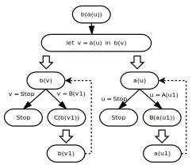
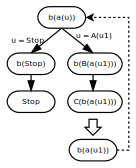

# Какой язык лучше суперкомпилировать: "строгий" или "ленивый"?

**Сергей Романенко**

**30 мая 2009 г.**

Как объяснялось в заметках

* [Что такое суперкомпиляция?](01-what-is-scp.md)
* [Обобщение конфигураций при суперкомпиляции](02-generalization.md)
* [Ранняя история суперкомпиляции](03-early-history.md)
* [С чем едят "гомеоморфное вложение".](04-homeomorphic-embedding.md)

метавычисления (разновидностью которых является суперкомпиляция),
представляют собой некоторое обобщение обычных вычислений. Поэтому,
разным моделям обычных вычислений соответствуют и разные разновидности
метавычислений.

Логика получается такая. Выбираем язык, программы на котором собираемся
преобразовывать. Выбираем какой-то вариант семантики этого языка. При
этом понятно, что удобнее всего исходить из операционной семантики, ибо
метавычисления - это ведь тоже "вычисления", и операционная семантика к
ним находится ближе всего.

А из разных вариантов операционной семантики, ближе всего к
суперкомпиляции находится семантика, основанная на последовательном
преобразовании выражений ("упрощении" или "редукции" этих выражений).

При этом, в случае семантики, основанной на редукции, большинство языков
разделяется на две группы:

-   "Строгие" языки. При вычислении вызова функции, функция не начинает
    работать до тех пор, пока не вычислятся все её аргументы. Такой тип
    вычислений известен ещё как "вычисление изнутри наружу" или
    "передача параметров по значению" (call-by-value).

-   "Ленивые" языки. При вычислении вызова функции её аргументы
    вычисляются ровно настолько, насколько они нужны для вычисления
    вызова самой функции. Такой тип вычислений известен ещё как
    "вычисление снаружи внутрь" или "передача параметров по
    имени" (call-by-name). Точнее, между "ленивостью" и "вызовом по
    имени" есть тонкое различие, но в данный момент оно для
    нас несущественно.

С каким языком удобнее иметь дело в суперкомпиляторе: "строгим" или
"ленивым"?

Предположим, что входной язык суперкомпилятора - "строгий". Рассмотрим
следующую программу:

    а(A(x)) = B(a(x));
    a(Stop) = Stop;
    b(B(x)) = C(b(x));
    b(Stop) = Stop;
    f(u) = b(a(u));

Раз язык "строгий", то прежде чем вызывать функцию, нужно полностью вычислить её 
аргументы. Допустим, на вход функции `f` подали `A(A(Stop))`. Тогда вычисление 
происходит так:

    f(A(A(Stop))) ⟶ b(a(A(A(Stop)))

Теперь видим, что внутри аргумента функции `b` находится вызов функции `a`. 
Значит, функцию `b` пока не вызываем, и вычисляем вызов функции `a`. Получается:

    b(a(A(A(Stop))) ⟶ b(B(a(A(Stop)))) ⟶ b(B(B(a(Stop)))) ⟶ b(B(B(Stop)))

Ну вот, теперь аргумент функции `b` принял вид `B(B(Stop))`. Вызовов функций в 
нём больше нет. Поэтому, начинает "работать" вызов функции `b`:

    b(B(B(Stop))) ⟶ C(b(B(Stop))) ⟶ C(C(b(Stop))) ⟶ C(C(Stop))

Теперь обрабатываемое выражение больше не содержит вызовов функций, и 
окончательным результатом вычислений считается `C(C(Stop))`.

Теперь, допустим, нам захотелось изучить процесс вычисления "в общем виде", 
когда аргумент неизвестен. Т.е., "вычислить" `f(u)`, где значение `u` - 
неизвестно. Если мы хотим действовать "честно", т.е. так, чтобы метавычисление 
происходило "точно так же", как и обычное вычисление, мы должны и в 
суперкомпиляторе вычислять выражения "изнутри наружу".

Берём `f(u)` и начинаем делать прогонку.

    f(u) ⟶ b(a(u))

Теперь надо рассмотреть два случая: когда `u = Stop` и когда `u = A(u1)`, где 
`u1` - свежая переменная. Случаи, когда появляется `Stop` не очень интересные, 
поэтому сосредоточимся только на одной ветви в дереве конфигураций. Получается:

    b(a(u)) ⟶{u=A(u1)}⟶ b(B(a(u1))) ⟶{u1=A(u2)}⟶ b(B(B(a(u2))))

Видно, что выражение раздувается и раздувается: всё время появляются новые 
экземпляры конструктора `B`, и продолжать так можно бесконечно. С этим нужно 
как-то бороться! Ведь нужно получить конечный граф конфигураций! И способ борьбы 
известен: обобщение и зацикливание.

Надо сказать, что "свисток", основанный на отношении гомеоморфного
вложения в данном случае срабатывает вполне адекватно. Сравним выражения

    b(a(u)) b(B(a(u1)))

Если присмотреться, то видно, что верхнее выражение вложено в нижнее: если из 
нижнего выражения вымарать конструктор `B`, то получается выражение `b(a(u1))`, 
которое совпадает с `b(a(u))` с точностью до имён переменных.

При этом, `b(B(a(u1)))` не является частным случаем `b(a(u))`, поскольку на что 
переменную `u` ни заменяй, выражение `b(B(a(u1)))` получить невозможно. 
Проклятый конструктор `B` мешает!

Поэтому, суперкомпилятор сравнивает `b(a(u))` и `b(B(a(u1)))`, и находит их 
максимальную общую часть `b(v)`, т.е. такое выражение, что `b(a(u))` и 
`b(B(a(u1)))` являются его частными случаями. Заменяем `v` на `a(u)` - получаем 
первое выражение. Заменяем `v` на `B(a(u1))` - получаем второе выражение.

После этого суперкомпилятор уничтожает всё поддерево, которое "выросло" из 
`b(a(u))` и "обобщает" выражение `b(a(u))`, заменяя его на
`let v=a(u) in b(v)`. В результате получается такой граф конфигураций

которому соответствует остаточная программа, которая, по-сути, совпадает
с исходной программой. Другими словами, суперкомпиляция ничего
интересного не даёт.

Но тут возникает такая "хулиганская" идея: а зачем во время метавычислений 
строго следовать тому порядку, который установлен для обычных вычислений. Вот, 
допустим, у нас в процессе метавычислений получилось выражение `b(B(a(u1)))`. 
Т.е. внутренняя функция `a` поработала-поработала и вытолкнула готовую часть 
своего результата наружу (в виде конструктора `B`). А почему-бы сразу не 
воспользоваться этой информацией? А то функция `b` торчит снаружи, ничего не 
делает и скучает. А можно ведь и не дожидаться, пока внутренний вызов функции 
вычислит результат до конца, а сразу начинать обрабатывать ту часть результата, 
которая "вылезла" наружу. Поэтому, попробуем воспользоваться правилом

    b(B(x)) = C(b(x));

из определения функции `b`, и выполним такое преобразование:

    b(B(a(u1))) ⟶ С(b(a(u1)))

Теперь вынимаем из конструктора его аргумент `b(a(u1))` и видим, что это 
выражение совпадает с выражением `b(a(u1))`, которое уже встречалось раньше. 
Значит, можно "зациклить", добавив к графу обратную ссылку. Получается такой 
граф конфигураций:

Это уже кое-что! Если из этого графа построить остаточную программу,
получается

    g(Stop) = Stop;
    g(A(x)) = C(g(x));
    f(u) = g(u);

Видно, что эта программа существенно отличается от исходной! Исходная программа 
реализовывала двухпроходный алгоритм: во время первого прохода все `A` 
заменяются на `B`, а во время второго прохода все `B` заменяются на `C`. А после 
суперкомпиляции получается программа, которая делает только один проход по 
исходным данным, сразу же заменяя `A` на `C`. (Именно такой результат выдаёт 
суперкомпилятор [SPSC][]: [Compose][].)

Итак, получается, что при суперкомпиляции выгодно следовать такой
стратегии: даже если при обычном вычислении выражения вычисляются
"изнутри наружу", при суперкомпиляции выгодно стараться вычислять
выражения "снаружи внутрь". Как только какой-то вызов функции "видит",
что появилось достаточно информации для выполнения шага вычислений,
можно сразу же этот шаг и выполнить. И тогда суперкомпилятор начинает
делать разные интересные вещи, вроде превращения многопроходных
алгоритмов в однопроходные.

Однако же, сразу возникают и разные нехорошие сомнения и подозрения.
Если во время метавычислений придерживаться той же логики, на которой
основаны обычные вычисления, то естественно надеяться на то, что
суперкомпилятор сгенерирует остаточную программу, эквивалентную
исходной. (Хотя, вобще говоря, кто ж его знает? Вопрос тонкий, и,
по-хорошему, для каждого конкретного суперкомпилятора необходимо
какое-то доказательство того, что он "всё делает правильно".)

Но если обычные вычисления следуют одной логике, а метавычисления -
совсем другой, то не получится ли из-за этого какой-нибудь гадости?
Например, рассмотрим программу:

    omega(x) = omega(x);
    erase(x) = Stop;
    f(u) = erase(omega(Nil));

Если обычное вычисление работает по принципу "изнутри наружу", то
программа зацикливается:

    erase(omega(Nil)) ⟶ erase(omega(Nil)) ⟶ erase(omega(Nil)) ⟶ ...

Если суперкомпилятор тоже работает по принципу "изнутри наружу", то он
изготовит остаточную программу, эквивалентную исходной. А что будет,
если суперкомпилятор начнёт выполнять метавычисления "снаружи внутрь"?
Тогда во время вычисления получается такая последовательность выражений:

    f(u) ⟶ erase(omega(Nil)) ⟶ Stop

Ведь функция `erase` не использует какую-либо информацию о своём
аргументе: просто выкидывает его - и всё. А если аргумент не нужен, так
зачем его и вычислять?

Логика, вроде, и хорошая, но она приводит к тому, что суперкомпилятор
генерирует остаточную программу, которая, мягко говоря (и грубо
выражаясь), не совсем эквивалентна исходной. Исходная программа ***для
любых*** исходных данных ***зацикливалась***, а в результате
суперкомпиляции получилась программа, которая ***для любых*** исходных
данных ***завершается*** и выдаёт `Stop`.

Тем не менее, многие суперкомпиляторы работают именно так. Например,
суперкомпилятор [SCP4][] обрабатывает программы на языке Рефал (Refal).
Рефал - это "строгий" язык, т.е. вызовы функций в нём выполняются
"изнутри наружу". Но метавычисления (прогонку) SCP4 выполняет "снаружи внутрь".
И остаточная программа не всегда эквивалентна исходной.

Однако, дела обстоят не так уж и плохо. Можно доказать, что если суперкомпилятор 
обрабатывает программу на "строгом" языке, используя стратегию "снаружи внутрь", 
то остаточная программа всё же эквивалентна исходной на области определения 
исходной программы. Другими словами, если для некоторых входных данных `X` 
исходная программа не зацикливается и выдаёт некий результат `R`, то и 
остаточная программа для исходных данных `X` не зацикливается и выдаёт тот же 
результат `R`. Но если для некоторых входных данных `X` исходная программа 
зацикливается (или аварийно завершается), то остаточная программа может сделать 
всё что угодно: либо тоже зациклиться, либо "упасть" (аварийно завершиться), 
либо выдать какой-нибудь бред.

Считать ли такое поведение суперкомпилятора "хорошим" или "плохим" -
зависит от того, каким способом и для чего мы собираемся использовать
суперкомпилятор. Упрощённо говоря, суперкомпиляция может использоваться
для двух совершенно разных целей:

-   Оптимизации программ (повышение скорости работы и уменьшение
    размера программ).

-   Анализа формальных систем, представленных в виде программ (через
    выявление и доказательство свойств программ).

Если суперкомпилятор предполагается использовать для ***оптимизации***
программ, то

-   Нет возможности выбирать или изменять входной язык суперкомпилятора.
    Есть некий язык и требуется программы на этом языке оптимизировать.

-   Можно не сохранять поведение исходной программы для тех случаев,
    когда исходная программа "падает" или зацикливается (если
    предполагать, что перед запуском остаточной программы есть
    возможность проверить допустимость данных, подаваемых на вход).

Если суперкомпилятор предполагается использовать для ***анализа***
формальных систем, то ситуация меняется.

-   Нет необходимости работать с входным языком, который навязан извне
    ("по историческим причинам" или потому, что "много людей на нём
    программируют"). Вместо этого, можно использовать входной язык,
    который (1) обладает большой изобразительной силой и (2) для которого
    легко и приятно делать суперкомпилятор.

-   Желательно, чтобы суперкомпилятор строго сохранял
    семантику программ.

С первым пунктом всё более или менее понятно. А пункт второй попробую
пояснить с помощью конкретного примера.

Допустим, у нас возникло желание доказать эквивалентность двух выражений `A` и 
`B`. Как это сделать? Можно применить такой "ломовой" способ. Пусть `sc(A)` и 
`sc(B)` - результат суперкомпиляции выражений `A` и `B` соответственно. И вот, 
мы сравниваем `sc(A)` и `sc(B)` и видим, что они совпадают! (Ну, не совсем, а с 
точностью до "тривиальных различий" вроде переименования переменных.) Отсюда 
строим цепочку заключений:

* `A` "эквивалентно" `sc(A)`,
* `sc(A)` "то же самое, что и" `sc(B)`,
* `sc(B)` "эквивалентно" `B`.

Стало быть, `A` эквивалентно `B`!

Подробнее об этом способе доказательства эквивалентности можно почитать
в статье:

* Ilya Klyuchnikov and Sergei Romanenko. Proving the Equivalence of
  Higher-Order Terms by Means of Supercompilation. Accepted for *PSI'09:
  Seventh International Andrei Ershov Memorial Conference "PERSPECTIVES OF
  SYSTEM INFORMATICS", 15 - 19 June, 2009, Novosibirsk, Akademgorodok,
  Russia*.
  [PDF](http://pat.keldysh.ru/%7Eroman/doc/2009-Klyuchnikov_Romanenko--Proving_the_Equivalence_of_Higher-Order_Terms_by_Means_of_Supercompilation.pdf)

Способ - ясный и простой. Но он основан на допущении, что при
суперкомпиляции остаточная программа *строго эквивалентна исходной*. А
если она "эквивалентна, но не совсем", вся вышеприведённая цепочка
рассуждений рассыпается в пыль.

Как же можно преодолеть противоречие между логикой, по которой работают
обычные вычисления, и логикой, по которой работает суперкомпилятор? Да
очень просто: взять и устранить это различие! Пусть и обычные вычисления
выполняются по принципу "снаружи внутрь". (Так и сделано в случае
суперкомпиляторов [SPSC][] и [HOSC][].)
Зачем преодолевать противоречие, если можно сделать так, чтобы оно
просто-напросто исчезло? Как говорили остряки конца 18 века: "Лучшее
средство от перхоти - гильотина!".

Однако же, такой подход легко осуществим только в том случае, если мы
хотим использовать суперкомпиялтор не для оптимизации, а для анализа
формальных систем. Если же суперкомпилятор предназначен для оптимизации,
приходится работать с тем входным языком, который дан "от Бога", и
семантику которого "подкрутить" уже невозможно.

Например, суперкомпилятор [SCP4][] предназначен для обработки программ
на Рефале, а в Рефале вызовы функций вычисляются изнутри наружу. Так уж
устроен Рефал, а когда появился Рефал, до суперкомпиляции (и связанных
с нею проблем) ещё никто не додумался.

---

[Оригинал послания и комментарии](http://metacomputation-ru.blogspot.com/2009/05/meta-ru-by-value-vs-by-name.html)

[SCP4]: http://www.botik.ru/pub/local/scp/refal5/references.html

[SPSC]: https://sergei-romanenko.github.io/spsc/

[HOSC]: https://sergei-romanenko.github.io/hosc-docs/

[Compose]: http://spsc.appspot.com/view?key=agpzfnNwc2MtaHJkcjMLEgZBdXRob3IiGnNlcmdlaS5yb21hbmVua29AZ21haWwuY29tDAsSB1Byb2dyYW0YAQw
