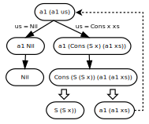
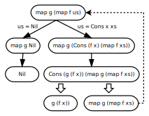

# Суперкомпиляция функций высших порядков

**14 июня 2009 г.**

В послании
[Что такое суперкомпиляция?](01-what-is-scp.md)
было описано, как выглядит суперкомпиляция для случая простого
функционального языка "первого порядка".

Теперь пришло время поговорить о суперкомпиляции функций "высших
порядков". Что такое "высший порядок", хорошо знает любой поклонник
функционального программирования (если, конечно, под "функциональными
языками" подразумевать языки вроде Standard ML и Haskell). Однако, как я
подозреваю, среди программистов всё ещё встречаются отсталые элементы,
ещё не проникшиеся возвышенными принципами "высшей функциональности". :-)

Поэтому, во избежание всякого рода недоразумений, начну рассказ с
рассмотрения вопроса, чем, собственно говоря, "высший" порядок
отличается от "первого"?

Что такое "язык первого порядка"? Обычно имеют в виду, что имеется некое
разделение/сегрегация/дискриминация обрабатываемых данных на данные
"первого порядка" (first-order) и "высших порядков" (higher-order).
Применительно к функциональным языкам это (как правило) сводится к тому,
что проводится различие между "функциями" и "нефункциями". "Нефункции" -
это "обычные" данные, вроде чисел, строк, деревьев, а "функции" - ну,
это "функции", которые можно применять к данным "первого порядка"...

Как известно, в мире людей всякая дискриминация и сегрегация считается
чем-то подозрительным и нехорошим (а на ЮАР за это даже санкции
накладывали). Поэтому, и в случае программирования, язык, в котором
цветёт пышным цветом дискриминация и сегрегация, выглядит как-то
нехорошо. Дело усугубляется ещё и следующей патологией. Поскольку
функции являются сущностями "высшего порядка", было бы естественно
ожидать, что они должны обладать большими "правами и возможностями" по
сравнению с сущностями "первого порядка". В мире людей дело обстоит
именно так: дискриминация заключается в том, что вывешиваются таблички
"только для...", и те, кого пускают - это "высшие", а кого не пускают -
это "низшие". Но в мире программирования всё устроено ровно наоборот! В
случае языка "первого порядка", разные ограничения "прав и свобод" имеют
место как раз в отношении "высших". Например, строка может выдаваться в
качестве результата функции, а функция - не может. Строка может быть
элементом списка - а функция не может.

Поэтому, когда мы переходим от языка "первого порядка" к языку "высшего
порядка", расширяются возможности как раз "высших сущностей", а не
низших. А именно, в функциональном языке "высшего порядка", функции
объявляются "полноправными значениями" (first-class values).

Кстати, не следует путать английские термины "first-order" и
"first-class"! С виду - похоже, а смысл - разный. "First-class" -
означает именно "полноправный", по аналогии с выражением "полноправный
гражданин" ("a first-class citizen").

Итак, в чём же заключается "полноправие" функций в языке высшего
порядка? А в том, что с функциями можно обращаться так же, как со
значениями "первого порядка":

1. Новые функции могут порождаться динамически в процессе работы программы.

2. Функции могут передаваться внутрь других функций в качестве параметров.

3. Функции могут выдаваться в качестве результатов функций.

4. Функции могут вставляться внутрь данных "первого порядка" (например,
   в качестве элементов списков или аргументов конструкторов).

Итак, языки "высшего порядка" отличаются от языков "первого порядка"
тем, что таблички "только для..." снимаются, и возможности функций
возрастают. Но, конечно, на самом-то деле, возможности возрастают не
только у функций, но и у программиста, который пишет программу. Можно
делать то, что раньше делать было нельзя! Можно применять всякие трюки и
приёмчики, которые в терминах языка первого порядка было невозможно даже
сформулировать! При этом, однако, оказывается, что новые содержательные
возможности требуют и некоторой ревизии на уровне синтаксиса языка
программирования.

Рассмотрим, например, такую программу на языке первого порядка:

    a1(Nil) = Nil;
    a1(Cons(x, xs)) = Cons(S(x), a1(xs));
    a2(xs) = a1(a1(xs));

Эта программа работает с натуральными числами, представленными в виде `Z`,
`S(Z)`, `S(S(Z))` ..., и списками, представленными в виде
`Cons(A, Cons(B, Cons(C, Nil)))`. Функция `a1` "проходится" по элементам списка, и к каждому элементу списка прибавляет 1.

Эта функция нам понадобится в дальнейшем в качестве "подопытного
кролика" для демонстрации некоторых аспектов суперкомпиляции, но в
данный момент нас интересует форма, в которой она записана.

В языке первого порядка принято записывать применение функции `f` к
аргументу `x` в виде `f(x)`. До тех пор, пока функции не могут выдавать
функции в качестве результата, такая запись удобна. Но, допустим, что
результатом вычисления `f(x)` является функция, которую мы хотим применить
к аргументу `y`. Тогда получается запись вида `(f(x))(y)`. Выглядит уже
как-то громоздко (даже если сократить её до `f(x)(y)`). Поэтому, в языках
высшего порядка выражения вида `f(x)` начали записывать как `f x`.
Преимущество такой записи особенно ясно проявляется именно в случае
функций, вырабатывающих функции: вместо `f(x)(y)` получается `f x y`. При
этом договорились, что "операция" применения функции а аргументу
считается ассоциативной влево. Т.е. `f x y z` означает именно
`(((f x) y) z)`.

Извиняюсь, что трачу время и место для объяснения таких "тривиальных"
вещей, но они тривиальны для тех, кто привык иметь дело с языками вроде
SML или Хаскеля. А для всего остального человечества осознание того, что
означает `f x y z`, требует некоторого "выворачивания мозгов наизнанку".

Конечно, переход к записи `f x y z`, кроме улучшения внешнего вида
выражений, приводит и к некоторым другим последствиям. Например, в
случае языков первого порядка, обычно имеются средства для определения
функций от "нескольких аргументов". Например, применение функции `f` "от
трёх аргументов" к `x`, `y`, `z` записывается как `f(x, y, z)`.
Что такое `(x, y, z)` - это в разных языках трактуется по-разному.
Например, в SML
считается, что все функции имеют ровно один аргумент, т.е. `x`, `y`, `z`
нужно сначала "слепить" в одно значение (упорядоченную тройку), и подать на
вход функции. А в некоторых языках, например, во входном языке
специализатора [Unmix](http://code.google.com/p/unmix/) или
суперкомпилятора [SPSC](https://sergei-romanenko.github.io/spsc/), считается, что
каждая функция имеет фиксированную "арность" (arity), т.е. фиксированное
количество аргументов на входе. В этом случае, запись `f(x, y, z)` должна
восприниматься как единое целое, т.е. `(x, y, z)` без `f` отдельного смысла
не имеет.

Однако, в случае языка высшего порядка, сразу же возникает "крамольная"
мысль: а зачем нужны функции от нескольких аргументов. Вместо того,
чтобы писать `f(x, y, z)` мы можем писать `f x y z`. При этом, конечно,
требуется немного переопределить функцию `f` и считать, что после
получения аргумента `x` функция `f` выдаёт не окончательный результат, а
новую функцию `(f x)`, которая ожидающую следующий аргумент `y`. Применяем
эту функцию к `y` - и снова получаем функцию `(f x y)`, ожидающую аргумент
`z`. А вычислив `(f x y) z` получаем окончательный результат.

Что касается конструкторов для данных первого порядка (вроде
конструктора `Cons`), то их вызовы тоже логично писать не как `Cons(x, y)`,
а как `Cons x y`.

Тут, правда, возникает такой вопрос: а как записать функцию,
вырабатывающую функции? Для этого в языках высшего порядка предусмотрены
"λ-выражения. Например, запись `(\x -> S(x))` обозначает функцию,
которая берёт `x` в качестве аргумента и надевает на него конструктор `S`.
Другими словами функцию `add1`, надевающую `S`, можно определить двумя
эквивалентными способами:

    add1 x = S(x);

    add1 = \x -> S(x);

Самое приятное свойство λ-выражений в том, что они, на самом деле,
являются (в общем случае) не "функциональными константами", а
"генераторами функций", поскольку при каждом исполнении λ-выражения
может генерироваться новая функция! Например, если `add` - сложение
чисел, то

    addN n = \x -> add n x;

определяет такую функцию addN, что (addN n) вырабатывает функцию,
прибавляющую `n` к аргументу. Например, `addN (S(S(Z))` - это
функция `(\x -> add (S(S(Z))) x)`,
прибавляющая 2 к аргументу. Весь фокус в том, что
λ-выражение `\x -> add n x` содержит "свободную" переменную `n`, и для
разных `n` λ-выражений генерирует разные функции.

Теперь у нас есть способ переделать функцию `f` вызывавшуюся как
`f(x, y, z)`, таким образом, чтобы её вызов выглядел как `f x y z`.
А именно, если исходное определение функции `f` имело вид

    f(x, y, z) = E;

его можно переделать так:

    f = \x -> (\y -> (\ z -> E));

или даже как

    f = \x y z -> E;

если воспользоваться тем, что в функциональных языках "с лямбдами"
обычно считается, что "надевание лямбды" ассоциативно вправо. Т.е.
`\x -> \y -> E` эквивалентно `\x -> (\y -> E)`. Также, для краткости,
разрешается записывать вложенные "лямбды" в сокращённом виде:
`\x y -> E` эквивалентно `\x -> \y -> E`.

А ещё более кратко определение `f` можно записать в виде

    f x y z = E;

что является сокращением для `f = \x y z -> E;`.

Уф! Покончив со всякой мутью, связанной с системами обозначений,
займёмся, наконец, суперкомпиляцией. "Вернёмся к нашему барану" в виде
функции `a2`. Перепишем её в обозначениях "высшего порядка":

    a1 Nil = Nil;
    a1 (Cons x xs) = Cons (S x) (a1 xs);
    a2 xs = a1 (a1 xs);

Стала ли от этого программа "лучше"? Дело вкуса и привычки... Во всяком
случае, скобочек и запятых в программе стало меньше. Тут, правда, есть
одна тонкость: в левых частях определения функции `a1` появились образцы,
которые анализируют структуру аргумента. На самом-то деле, эта запись
является сокращением для некоторой комбинации из λ-выражений и
"case-выражений", но мы пока вникать в это не будем, считая, что смысл
функции `a1` вполне понятен на неформальном уровне.

Теперь попытаемся просуперкомпилировать выражение `a1(a1 us)` в духе того,
как это делалось в послании
[Что такое суперкомпиляция?](01-what-is-scp.md).

Получается такой граф конфигураций:

Если построить по этому графу остаточную программу, получится такое
определение функции:

    a2 Nil = Nil;
    a2 (Cons x xs) = Cons (S(S x)) (a2 xs);

Теперь становится видно "невооружённым глазом", что в результате
вычисления выражения `a1 (a1 us)`, к каждому элементу списка us
прибавляется 2.

Пока что, ничего нового и интересного не произошло, поскольку, хотя мы и
перешли к обозначениям "высшего порядка", сама функция какой была, такой
и осталась: старой, доброй функцией "первого порядка".

А теперь наступает самый интересный момент! Изобразительные средства
"высшего порядка" дают нам новые возможности по структуризации программ:
во многих случаях монолитную программу удаётся представить в виде
"композиции" из нескольких независимых частей. Т.е., конечно, это можно
делать и в случае языка "первого порядка", но в случае "высшего порядка"
таких возможностей больше: практически любой кусок программы из любого
определения некоторой функции `f` можно "вырезать", объявить отдельной
функцией `g`, и "вытащить" `g` за пределы определения функции `f`.

Вот, например, посмотрим внимательно на определение функции `a1`:

    a1 Nil = Nil;
    a1 (Cons x xs) = Cons (S x) (a1 xs);

В этом определении свалены в одну кучу две совершенно разные вещи:

1. Применение некоей операции к каждому элементу списка.
2. Прибавление единицы к числу.

Понятно, что пункт 1 - это некоторая общая идея, которая не зависит от
того, что именно совершается над каждым элементом списка. А пункт 2 -
это другая идея, которая никак не связана со списками. Поэтому,
определение функции `a1` мы можем "обобщить", добавив второй параметр,
обозначающий произвольную операцию над элементом списка. Получается
"классическая" функция `map`, а программа принимает вид:

    map f Nil = Nil;
    map f (Cons x xs) = Cons (f x) (map f xs);
    a1 xs = map (\x -> S x) xs;

И теперь возникает возможность обобщить и задание, предлагаемое
суперкомпилятору: пусть он теперь изучит, что получается при вычислении
выражения вида

    map g (map f us)

Новизна ситуации здесь заключается в том, что в случае "первого порядка"
конфигурации содержали переменные и вызовы функций. При этом, переменные
изображали некие неизвестные данные "первого порядка" (т.е., заведомо -
"нефункции"), а вызовы функций соответствовали функциям, определённым в
программе. А теперь конфигурации могут содержать переменные,
обозначающие неизвестные функции и вызовы неизвестных функций.

Не возникают ли от этого какие-то ужасные новые трудности в процессе
суперкомпиляции? Посмотрим! Попробуем просуперкомпилировать выражение
`map g (map f us)`. Получается такой граф конфигураций:

Видно, что граф получается конечным из-за того, что из конфигурации `map`
`g (map f us)` в конце-концов получается конфигурация `map g (map f u1)`,
совпадающая с исходной с точностью до имён переменных. Картина - очень
похожая на ту, что наблюдалась в случае суперкомпиляции "первого порядка"...

Однако, при этом, задача для суперкомпилятора была поставлена в более
общем виде, и решение получилось тоже для более общего случая. Если
построить из графа конфигураций остаточную программу, получается такая
функция:

    map2 g f Nil = Nil;
    map2 g f (Cons x xs) = Cons (g (f x)) (map2 g f xs);

Приятно и поучительно: суперкомпилятор обнаружил такой "закон природы":
если ко всем элементам списка применить операцию `f`, а потом - операцию
`g`, то это - то же самое, что один раз применить ко всем элементам списка
композицию операций `f` и `g`.

(А в случае "первого порядка" суперкомпилятор делал то же самое, но для
частного случая, когда `f` и `g` были операцией "прибавления единицы".)

А теперь возникает следующий вопрос: на бумаге-то у нас всё хорошо
получилось. Но, как гласит народная мудрость, "гладко было на бумаге, да
забыли про овраги"... В качестве ответа, до некоторой степени, может
служить суперкомпилятор
[HOSC](http://code.google.com/p/hosc/).
Можно посмотреть на него и убедиться, что с кое-какими заданиями этот
суперкомпилятор справляется. В том смысле, что структура остаточной
программы не совпадает со структурой исходной программы. :-)

Представляет ли HOSC "практический интерес" (или, другими словами, можно
ли его применить для "решения важной народнохозяйственной задачи"), пока
сказать трудно. Но штука - забавная.

Осталось сделать несколько замечаний по поводу языка, программы на
котором обрабатывает HOSC. Поскольку HOSC - это изделие
экспериментальное, его входной язык - "минималистский". По сути он
представляет собой некоторое подмножество Хаскеля (Haskell). Этот язык
(в его состоянии на данный момент) описан на странице
[Higher Order Lazy Language (HLL)](http://code.google.com/p/hosc/wiki/HigherOrderLazyLanguage).

HLL - язык со статической типизацией (в смысли Хиндли-Милнера). Писать
определения функций в виде

    f x y z = E;

пока не разрешается. Нужно писать с "лямбдами" в правой части:

    f = \x y z -> E;

Сопоставление с образцом можно делать с помощью case-выражений, в
которых каждый образец имеет простейший вид: `c x1 x2 ... xN`. Поэтому,
определение функции `map`

    map f Nil = Nil;
    map f (Cons x xs) = Cons (f x) (map f xs);

на самом деле, должно быть записано так:

    map = \f us -> case us of {
      Nil -> Nil;
      Cons x xs -> Cons (f x) (map f xs);
    };

С другой стороны, в HLL есть конструкция letrec, с помощью которой можно
записывать "локальные определения функций". Это позволяет уменьшить
количество параметров у функций, когда эти параметры "просто так"
перетаскиваются от одного вызова функции к другому. Например, определение

    map2 g f Nil = Nil;
    map2 g f (Cons x xs) = Cons (g (f x)) (map2 g f xs);

можно переписать так:

    map2 = \g f us ->
      letrec loop = \us -> case us of {
        Nil -> Nil;
        Cons x xs -> Cons (g (f x)) (loop xs);
      } in loop us;

HOSC активно использует letrec-и при генерации остаточной программы.

Вот пример полного задания на суперкомпиляцию:

    data List a = Nil | Cons a (List a);
    data Nat = Z | S Nat;

    mapN (S(S(S Z))) f xs

    where

    map = \f us -> case us of {
      Nil -> Nil;
      Cons x xs -> Cons (f x) (map f xs);
    };

    mapN = \n f us -> case n of {
      Z -> us;
      S n1 -> map f (mapN n1 f us);
    };

Здесь сначала идут объявления типов данных, используемых в программе.
Потом - выражение, которое вычисляет программа (и которое становится
начальной конфигурацией при суперкомпиляции). Через свободные переменные
этого выражения в программу передаются начальные данные при запуске.
Затем идёт ключевое слово where, за которым следуют объявления функций.
Засовываем эту программу в HOSC (задание
[mapN n f xs](http://hosc.appspot.com/view?key=agpzfmhvc2MtaHJkcjQLEgZBdXRob3IiGnNlcmdlaS5yb21hbmVua29AZ21haWwuY29tDAsSB1Byb2dyYW0Y4V0M),
и получаем такой результат:

    data List a = Nil | Cons a (List a);
    data Nat = Z | S Nat;
    (letrec g=(\x4-> case x4 of {
        Nil -> Nil;
        Cons s2 z1 -> (Cons (f (f (f s2))) (g z1)); })
      in (g xs))

Результат неплохой. Функция `mapN` применяет функцию `f` ко всем элементам
списка `xs`, повторяя эту процедуру `n` раз. В данном случае в начальном
выражении задаётся, что n=3. И в остаточной программе получается
однопроходный алгоритм, который применяет `f` к каждому элементу
списка `xs` три раза.
