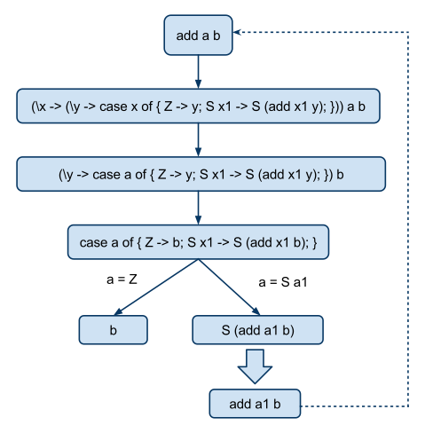

# Прогонка для функций высших порядков

**Сергей Романенко**

**18 июня 2009 г.**

В заметках

* [Что такое суперкомпиляция?](01-what-is-scp.md)
* [Какой язык лучше суперкомпилировать: "строгий" или "ленивый"?](05-by-value-vs-by-name.md)
* [Суперкомпиляция функций высших порядков](08-ho-scp.md)

речь шла о том, что метавычисления являются "пародией" на обычные
вычисления. А "прогонка" - простейший вариант метавычислений (без
обобщений и зацикливаний). В общем случае прогонка порождает бесконечное
дерево, которое можно сделать конечным, применяя "обобщение"
конфигураций и "зацикливание".

Сейчас мы постараемся подробнее разобраться, как выглядит прогонка в
случае "ленивого" языка с функциями высших порядков. Суперкомпилятор
[HOSC][] обрабатывает программы именно на языке такого рода:
[Higher Order Lazy Language (HLL)][HLL].

В случае языка HLL, программа имеет следующий вид:

    d_1 ... d_N e_0 where f_1 = e_1 ; ... f_N = e_N ;

и содержит следующие части:

* `d_1 ... d_N` - объявления типов для данных, обрабатываемых
  программой. (Сейчас эта часть программы нас не очень интересует.)

* `e_0` - "целевое" выражение. Считается, что исполнение программы
   сводится к вычислению `e_0`. Если `e_0` содержит свободные переменные,
   то через них в программу передаются исходные данные.

* `f_1 = e_1 ; ... f_N = e_N ;` - определения глобальных функций. Эти
  функции могут использоваться внутри целевого выражения `e_0`.

Вот пример программы:

    data Nat = Z | S Nat;

    add a b

    where

    add = \x y -> case x of { Z -> y; S x1 -> S (add x1 y); };

Целевое выражение содержит три свободные переменные `a` и `b`, через которые
в программу и передаются исходные данные, а исполнение программы
сводится к тому, что в целевое выражение `add a b` подставляются значения
переменных `a` и `b`, после чего получившееся выражение и вычисляется.

Вот в этом и состоит различие между "обычным" вычислением выражения и
"прогонкой". При обычном вычислении обрабатываемое выражение не может
содержать **свободные** переменные, а при прогонке - может.

Заметим, что в случае вычислений первого порядка (как в суперкомпиляторе
[SPSC][] было достаточно сказать, что
выражение вообще не содержит переменные (или содержит), а в случае
высшего порядка приходится ещё различать свободные и связанные переменные.

Как выполняется такого рода программа, сначала рассмотрим на примере.
(И, с точки зрения людей, пишущих на Фортране, такой способ исполнения
программы выглядит как чистое извращение. :-) )

Допустим, на вход поступили такие данные:

    a = S Z;

    b = Z;

Подставляем значения `a` и `b` в `add a b`. Получается

    add (S Z) Z

И вот тут-то и начинается самое страшное. В случае языка первого порядка
(как в [SPSC][] мы сразу же, за один шаг, преобразовали бы это выражение
в выражение

    S (add Z Z)

сделав много разных дел:

1. Нашли бы определение функции `add`.
2. Распознали бы, какое правило из определения `add` применить. А для
   этого нужно было бы выполнить сопоставление в образцом.
3. Применили бы правило.

Но то, что было в случае "первого порядка" одним большим действием, в
случае HLL разбивается на несколько более элементарных действий.
Разбиение на мелкие действия хорошо с точки зрения компьютера, с точки
зрения тех, кто пишет статьи о суперкомпиляторе, и даёт некоторые
дополнительные возможности в процессе преобразований. Но есть и
"оборотная сторона медали"! При попытке "прокрутить" какие-то примеры
вручную, на бумаге, сразу же оказывается, что граф конфигураций жутко
раздувается. Точнее, раздувается не сам граф, как таковой, а
конфигурации, находящиеся внутри узлов графа. Что мы сейчас и увидим.

Итак, смотрим на выражение

    (add (S Z) Z)

На верхнем уровне - вызов функции `add`. Хорошо бы его применить к
аргументам. Чтобы сделать это, ищем определение функции `add`, и
подставляем его вместо имени функции! Таков уж язык высшего порядка. В
случае первого порядка, программа и данные строго разделены, но если мы
объявили, что функции являются "равноправными значениями" (first-class
values), различие между "программой" и "данными" рассеивается как
утренний туман (или, говоря ещё более поэтично, как нежные лепестки
цветка сакуры под весенним ветром). Если число можно подставить, можно и
функцию подставить. Что и делаем. Получается вот такая гадость:

    (\x -> (\y -> case x of { Z -> y; S x1 -> S (add x1 y); })) (S Z) Z

Концептуально - ясно и понятно. Но выписывать руками - сущее мучение.

Теперь выражение имеет вид `(\v -> e_0 ) e_1`, и понятно, что нужно
сделать дальше: применить функцию к аргументу. Т.е. в `e_0` заменить все
вхождения `v` на `e_1` . Конкретно, `(\x -> ...)` применяем к `S Z` и получаем

    (\y -> case S Z of { Z -> y; S x1 -> S (add x1 y); }) Z

Теперь `(\y -> ...)` применяем к `Z`. Получается

    case S Z of { Z -> Z; S x1 -> S (add x1 Z); }

И вот теперь наступает момент, когда нужно выполнить "сопоставление с
образцом". Аргумент case-выражения содержит конструктор `S` на верхнем
уровне. Поэтому, `S Z` сопоставляется с образцом `S x1`. При этом,
переменная `x1` принимает значение `Z`. После чего, мы извлекаем из
case-выражения ветвь

    S x1 -> S (add x1 Z);

и подставляем в `S (add x1 Z)` значение переменной `x1`, т.е. `Z`. После чего
обрабатываемое выражение принимает вид:

    S (add Z Z)

На верхний уровень выражения (из его глубин) выполз конструктор `S`. Что
делать дальше? В случае "строгого" языка нужно было бы продолжать
вычисления, поскольку в аргументе конструктора остался вызов функции
`add`. Нужно его вычислять, даже если результат этого вычисления не будет
использован.

Но в случае "ленивого" языка, результат вычисления может выдаваться
потребителю не весь сразу - а частями. В данном случае, "частичный
результат" (в виде конструктора `S` на верхнем уровне) - налицо. Поэтому,
можно считать, что вычисление "частично закончено". Но, предположим, что
некий потребитель "съел" верхний конструктор, и захотел использовать
значение его аргумента `add Z Z`. Ну что же, тогда вычисление
возобновляется, и получается такая последовательность преобразований:

    add Z Z

    (\x -> (\y -> case x of { Z -> y; S x1 -> S (add x1 y); })) Z Z

    (\y -> case Z of { Z -> y; S x1 -> S (add x1 y); }) Z

    case Z of { Z -> Z; S x1 -> S (add x1 Z); }

    Z

Т.е., "совсем" окончательный результат - `S Z`.

А теперь наступил момент, когда нужно перейти от "обычных" вычислений к
"метавычислениям". Что будет, если не подавать в программу исходные
данные, а оставить в целевом выражении переменные, и попытаться
вычислять "прямо так"? Оказывается, что это - не так уж трудно. Начинаем
с выражения `add a b`. И видим, что несколько первых шагов делаются точно
так же, как и в случае известных исходных данных:

    add a b

    (\x -> (\y -> case x of { Z -> y; S x1 -> S (add x1 y); })) a b

    (\y -> case a of { Z -> y; S x1 -> S (add x1 y); }) b

    case a of { Z -> b; S x1 -> S (add x1 b); }

А вот теперь появляется интересная ситуация: в аргументе case-выражения
- переменная `a`, значение которой неизвестно. Как выбрать нужную ветвь в
case-выражении?

Единственный выход - действовать "разбором случаев": рассмотреть
отдельно два случая: `a = Z` и `a = S a1`, где `a1` - новая переменная,
которая не встречалась в программе. В этот момент линейная
последовательность вычислений превращается в дерево!

Итак, для случая `a = Z` получается

    case Z of { Z -> b; S x1 -> S (add x1 b); }

    b

А для случая `a = S a1` получается

    case S a1 of { Z -> b; S x1 -> S (add x1 b); }

    S (add a1 b)

Дальше мы извлекаем из конструктора его аргумент, и начинаем изучать
процесс его вычисления отдельно (как и в случае языка первого порядка).
И видим, что нам повезло: изучать-то нечего, поскольку `add a1 b`
совпадает (с точностью до имён переменных) с начальной конфигурацией
`add a b`. Значит, можно сделать зацикливание и получить конечный граф
конфигураций:

Суперкомплятор HOSC именно такой граф и делает: [add a b][].

Впрочем, этот граф виден, если рассматривать пример через FireFox, ибо
для рисования графа используется svg-графика. FireFox рисует эти графы
хорошо, а видно ли в других браузерах - не уверен. Кажется, нужно
какие-то плагины устанавливать для отрисовки svg-графики...

Итак, пока мы занимались прогонкой, вроде бы никаких особых проблем (по
сравнению с "первым порядком") не возникло. Хотя, если описывать
прогонку для HLL аккуратно и со всеми подробностями, то это описание
получается довольно занудным. Приходится возиться со всякими понятиями,
вроде "слабая головная нормальная форма", "наблюдаемое", "редекс",
"контекст", и т.п. К счастью, при изучении конкретных примеров
суперкомпиляции, всего этого можно и не знать, а руководствоваться
здравым смыслом и общими принципами, на которых построены ленивые
вычисления.

(Но тех, кому интересно, могу порадовать тем, что в работе сейчас
находится документ, в котором будут подробно описаны внутренности
суперкомпилятора HOSC, в виде формул и всего прочего, что должно быть в
"научных" сочинениях.)

Более интересен другой вопрос! Ну хорошо, с прогонкой "высшего порядка"
всё, вроде, получается. Но ведь в суперкомпиляторе, кроме прогонки,
нужно делать и кое-что ещё: сравнивать конфигурации, строить обобщения
конфигураций, проверять, вкладывается ли одна конфигурация в другую или нет?

И здесь возникают кое-какие тонкости, связанные с тем, что в случае
"высшего порядка", переменные в конфигурациях могут быть как свободными,
так и связанными (в то время, как в случае "первого порядка", связанные
переменные в конфигурациях не появлялись).

Но это - тема для отдельного разговора...

**26 декабря 2009 г**

Вот он, обещанный в тексте послания, многострадальный документ,
описывающий внутренности HOSC-а!

Это - препринт, выложенный на сайте Института Прикладной математики
им.М.В.Келдыша:

*   Klyuchnikov I.G. Supercompiler HOSC 1.0: under the hood
    KIAM Preprint No. 63, Moscow, 2009

    The paper describes the internal structure of HOSC, an experimental
    supercompiler dealing with programs written in a higher-order
    functional language. A detailed and formal account is given of the
    concepts and algorithms the supercompiler is based upon.

    <http://library.keldysh.ru/preprint.asp?id=2009-63>

---

[Оригинал послания и комментарии](http://metacomputation-ru.blogspot.com/2009/06/ho-driving.html)

[SPSC]: https://sergei-romanenko.github.io/spsc/

[HOSC]: https://sergei-romanenko.github.io/hosc-docs/

[HLL]: https://sergei-romanenko.github.io/hosc-docs/HigherOrderLazyLanguage

[add a b]: http://hosc.appspot.com/view?key=agpzfmhvc2MtaHJkcjQLEgZBdXRob3IiGnNlcmdlaS5yb21hbmVua29AZ21haWwuY29tDAsSB1Byb2dyYW0YyWUM
