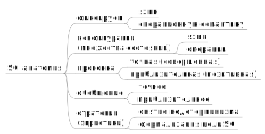

# Крупношаговая суперкомпиляция (big-step supercompilation)

**16 марта 2011 г.**

По поводу нынешнего послания вспомнился мне один эпизод из моего
детства. Это было в те времена, когда по радио часто исполняли
зажигательную песню “Русский с китайцем - братья навек!”.

Как-то, то ли в газете, то ли на каком-то плакате я увидел такую
картину. Некий китаец, с просветлённым и одухотворённым лицом, совершает
прыжок над пропастью. Одна нога китайца ещё опирается на одну сторону
пропасти (на которой находится что-то плохое), а другая нога уже
занесена над бездной. А на другой стороне пропасти находится что-то
очень хорошее и завлекательное.

Меня эта картинка заинтересовала, и я спросил взрослых, что это значит?
И мне объяснили, что строить светлое будущее - дело неспешное и
утомительное. Поэтому Председатель Мао, вождь китайского народа, решил
ускорить процесс, и придумал для этого теорию “большого скачка”. Поэтому
китаец и совершает прыжок над пропастью, на одной стороне которой
находится капитализм, а на другой - коммунизм. Тем самым реализуя
лозунг, выдвинутый Председателем Мао: “Три года упорного труда - десять
тысяч лет счастья”.

Вскоре после этого разговора я вдруг заметил, что песню “Русский с
китайцем - братья навек!” по радио передавать перестали. Про “большой
скачок” тоже начали как-то скептически говорить. И вообще, постепенно
как-то выяснилось, что китайцы - дураки, и над китайскими начальниками
даже можно вслух издеваться (и за это никого не накажут).

Применив свою способность к построению логических умозаключений (которая
как раз в это время начала у меня появляться), я догадался, что с тем
китайцем, который совершал прыжок, приключилась какая-то беда. Но сам
Китай и Председатель Мао от этого никуда не делись (раз уж их ругают по
радио). И что китайцы не такие уж дураки, как их изображают. Во всяком
случае, если они и хотели прыгнуть через пропасть, то не стали делать
это все разом, а решили сначала подождать, чем кончиться прыжок у того
энтузиаста, что был изображён на плакате (и, кстати, не имел никакого
портретного сходства с Председателем Мао).

И вот, мы уже живём в другую эпоху. Смеяться над китайцами мы уже
перестали... Не достигнув счастья за три года упорного труда, они
почему-то после этого не перестали упорно трудиться. И теперь скорее уже
у них есть основания над нами смеяться. “А хорошо смеётся тот, кто
смеётся последним...”

Тут уместно спросить: “А какое отношение имеет Китай к суперкомпиляции?”
И какое отношение имеет суперкомпиляция к теории “большого скачка” и к
теории “малых дел”? По поводу первого могу сказать, что мне известен по
крайней мере один аспирант, которого прислали из Китая для того, чтобы
он позанимался в России с суперкомпиляцией. Может быть, чтобы выяснить,
стоит ли этим делом вообще заниматься. А аспирантура - это как раз три
года. Так что, “три года упорного труда - …”.

С другой стороны, как выясняется, в области операционной семантики
языков программирования как раз существует два подхода: “мелкошаговая
семантика” (small-step semantics) и “крупношаговая семантика” (big-step
semantics). В некоторых случаях они эквивалентны (в отличие от сферы
политики и экономики). А в основе любого суперкомпилятора лежит та или
иная версия операционной семантики.

## Анатомия суперкомпиляции

Суперкомпиляция - это довольно абстрактная идея. Чтобы дойти от
суперкомпиляции, как идеи, до конкретного суперкомпилятора, требуется
пройти через следующие этапы.

  * Выбираем язык программирования.
  * Выбираем операционную семантику этого языка.
  * Придумываем язык, на котором описываются конфигурации (множества
    состояний). Реализуем набор операций над конфигурациями: проверку
    вложения и (аппроксимации) для объединения.
  * Придумываем прогонку как обобщение операционной семантики.
  * Вводим правила обобщения, разрешающие заменять конфигурации на более
    общие и правила зацикливания.
  * Получается отношение суперкомпиляции, описывающее отношение между
    исходными и остаточными программами.
  * Добавляем эвристики, целями которых обычно является
      - Устранение недетерминизма (уменьшение числа порождаемых
        остаточных программ), вплоть до получения детерминированной
        суперкомпиляции.
      - Формализация целей суперкомпиляции (какие остаточные программы
        считаются “хорошими”, а какие - “плохими”).

Вывод:

> Облик суперкомпилятора в значительной степени определяется не только
> входным языком, но ещё и тем вариантом операционной семантики
> этого языка, на котором основана прогонка.

## Семантика: мелкошаговая vs. крупношаговая

Есть два подхода к определению операционной семантики языка: семантика
малых шагов (small-step) и семантика большого шага (big-step). Или,
по-русски, “мелкошаговая” и “крупношаговая”.

Определяется мелкошаговая семантика следующим образом. Вводится понятие
*абстрактной машины*, которая в каждый момент находится в некотором
*состоянии*. Определяется понятие *перехода* из одного состояния в
другое. При этом процесс вычислений выглядит как последовательность
переходов из одного состояния в другое.

Абстрактная машина может быть как *детерминированной* (и тогда каждое
следующее состояние вычисляется из предыдущего с помощью /функции/),
либо - *недетерминированной* (и тогда допустимые пары из текущего и
следующего состояния описываются с помощью /отношения/).

В случае же крупношаговой семантики, смысл детерминированной программы
изображается функцией, “за один шаг” отображающей начальное состояние в
конечное. А “операционость” семантики заключается в том, что эта функция
описывается в терминах разбиения исходной задачи на конечное число
подзадач, с последующим получением решения исходной задачи путём
“конструктивной” композиции решений этих подзадач.

Если же требуется изобразить смысл недетерминированной программы, то
этот смысл изображается в виде функции, отображающей исходное состояние
в множество допустимых конечных состояний.

### Пример: CEK-машина

Для сравнения особенностей мелкошаговой и крупношаговой семантики,
рассмотрим следующий пример. В статье

  * Olivier Danvy and Kevin Millikin. 2008. On the equivalence between
    small-step and big-step abstract machines: a simple application of
    lightweight fusion. /Inf. Process. Lett./ 106, 3 (April 2008), 100-109.
    DOI=[10.1016/j.ipl.2007.10.010](http://dx.doi.org/10.1016/j.ipl.2007.10.010)
    [PDF](http://www.brics.dk/RS/07/16/BRICS-RS-07-16.pdf)

описаны две подхода к определению операционной семантики CEK машины.
CEK-машина реализует приведение λ-термов к слабой головной нормальной
форме с использованием редукции слева направо в аппликативном порядке.
Переменные изображаются индексами де Брёйна (de Bruijn indices).

(Кто не верит, что de Bruijn - это “де Брёйн”, может проверить это,
посмотрев, например, страницу
[Нидерландско-русская_практическая_транскрипция](https://ru.wikipedia.org/wiki/%D0%9D%D0%B8%D0%B4%D0%B5%D1%80%D0%BB%D0%B0%D0%BD%D0%B4%D1%81%D0%BA%D0%BE-%D1%80%D1%83%D1%81%D1%81%D0%BA%D0%B0%D1%8F_%D0%BF%D1%80%D0%B0%D0%BA%D1%82%D0%B8%D1%87%D0%B5%D1%81%D0%BA%D0%B0%D1%8F_%D1%82%D1%80%D0%B0%D0%BD%D1%81%D0%BA%D1%80%D0%B8%D0%BF%D1%86%D0%B8%D1%8F).
Впрочем, используют и транскрипцию "де Брюйн". Например:
[Брюйн (Bruijn, франц. Le Brun), Корнелис де](http://www.biograpedia.ru/node/3798).)

В статье семантика виртуальных машин запрограммирована на языке Standard
ML, мы же перепишем её на языке HLL, являющемся входным языком
суперкомпилятора HOSC (и представляющем собой подмножество языка Haskell).

Итак, сначала определяем понятие λ-терма:

    data Nat = Z | S Nat;
    data Term = Var Nat | Lam Term | App Term Term;

Понадобилось определить понятие натурального числа, поскольку
натуральные числа используются в качестве индексов де Брёйна.

Будем считать, что результатом вычисления терма (если это вычисление
завершается) является представление его слабой головной нормальной формы
в виде замыкания, имеющего вид `Clo t e`, где `t` - λ-терм, а `e` -
среда, приписывающая значения свободным переменным терма `t`. Среда при
этом представляет собой список из значений переменных. Заметим, что
имена переменных хранить в среде не требуется, поскольку индексы де
Брёйна прямо задают позиции для значений переменных в среде.

На языке HLL это описывается так:

    data List a = Nil | Cons a (List a);
    data Val = Clo Term (List Val);

Извлечение значения переменной `с` индексом `i` из среды `e` может быть
выполнено с помощью функции `lookup`:

    lookup = \i env ->
     case env of {
       Cons n env1 ->
         case i of {
           Z -> n;
           S i1 -> lookup i1 env1;
         };
     };

### Мелкошаговая семантика CEK-машины

Теперь нужно определить понятие состояния CEK-машины. В принципе, это
состояние является λ-термом, но этот терм представлен таким образом,
чтобы не требовалось каждый раз искать редекс (подтерм, подлежащий
преобразованию) начиная с самого верха. Для этого вводится понятие
редукционного контекста (смысл которого будет объяснён ниже):

    data RC = RC0
           | RC1 RC Term (List Val)
           | RC2 Val RC;

Мелкошаговая семантика CEK-машины определяется через понятие текущего
состояния:

    data Conf = Eval Term (List Val) RC
             | Apply RC Val;

    data State = Final Val | Inter Conf;

Работа CEK-машины распадается на шаги. Действия, предпринимаемые на
каждом шаге, зависят от того, какой вид имеет текущее состояние.

  * `Final v` . В этом случае состояние считается *заключительным*, а
    `v` - окончательным результатом вычисления.
  * `Inter conf`. В этом случае состояние считается *промежуточным*, а
    `conf` изображает текущую *конфигурацию* виртуальной машины.

Если состояние является промежуточным, оно содержит в себе конфигурацию
машины (не путать с “конфигурациями” в смысле суперкомпиляции), и
дальнейшие действия зависят от вида этой конфигурации.

  * `Apply c v` . Такая конфигурация означает, что значение `v` нужно
    вставить внутрь объемлющего контекста `c` и продолжить вычисление.
  * `Eval t e c` . Такая конфигурация означает, что терм `t` следует
    вычислить в среде `e`, а потом вставить результат в контекст `c`.

Как же вычисляется терм `t`, входящий в конфигурацию `Eval t e c`?
Способ вычисления `t` зависит от того, какой вид он имеет.

  * `Var i`. Нужно достать из окружения `e` значение переменной,
    находящееся в `e` в `i`-й позиции. И вставить это значение в
    контекст `c`. Значение переменной извлекается из контекста `с`
    с помощью функции `lookup` (описанной выше).
  * `Lam t0` . Нужно сформировать замыкание `Clo t0 e` и вставить его в
    контекст `c`. Помимо терма `t0` замыкание содержит и среду, в
    которой этот терм должен вычисляться.
  * `App t0 t1` . Этот случай - самый интересный. Нужно заняться
    вычислением терма `t0`, отложив вычисление терма `t1` на будущее.
    Для этого контекст `c` заменяется на новый контекст `RC1 c t1 e`,
    после чего вычисляется `t0`, и получается результат `v`, который
    вставляется в контекст `RC1 c t1 e`. А операция вставления `v` в
    контекст вида `RC1 c t1 e` реализована так, что начинается
    вычисление терма `t1` в окружении `e`, а `v` запоминается в
    контексте вида `RC2 v c1`.

Собрав всё воедино, получаем функцию `move`, реализующую преобразование
текущей конфигурации (незаключительного состояния) в следующее состояние:

    move = \conf ->
     case conf of {
       Eval t e c ->
         case t of {
           Var i -> Inter (Apply c (lookup i e));
           Lam t0 -> Inter (Apply c (Clo t0 e));
           App t0 t1 -> Inter (Eval t0 e (RC1 c t1 e));
         };
       Apply c v ->
         case c of {
           RC0 -> Final v;
           RC1 c1 t1 e -> Inter (Eval t1 e (RC2 v c1));
           RC2 v1 c1 ->
             case v1 of {
               Clo t2 e2 -> Inter (Eval t2 (Cons v e2) c1); };
         };
     };

Самое интересное место в этом определении - вставление значения `v` в
контекст вида `RC2 v1 c1`. Этот контекст означает, что наступил момент
применить замыкание `v1` к аргументу `v`. Для этого из замыкания
`Clo t2 e2` извлекается тело функции `t2` и среда `e2`, к среде `e2`
добавляется `v` (аргумент функции), после чего `t2` вычисляется в этой
среде.

Теперь осталось определить функцию-”погонялу” `drive`, приводящую
виртуальную машину в движение. Эта функция смотрит на текущее состояние.
Если это состояние - заключительное, то выдаётся окончательный результат
работы. Если состояние - незаключительное, выполняется переход в
следующее состояние (с помощью функции `move`) и процесс продолжается:

    drive = \state -> case state of {
      Final v -> v;
      Inter conf -> drive (move conf);
    };

И вот, наконец, функция `smallStepEval`, которая инициализирует и
запускает мелкошаговую виртуальную машину:

    smallStepEval = \t -> drive (Inter (Eval t Nil RC0));

### Крупношаговая семантика CEK-машины

Теперь рассмотрим другой вариант семантики CEK-машины: крупношаговую
семантику, реализованную в виде функции `bigStepEvaluate`:

    eval = \t e c ->
     case t of {
       Var i -> apply c (lookup i e);
       Lam t1 -> apply c (Clo t1 e);
       App t0 t1 -> eval t0 e (RC1 c t1 e);
     };

    apply = \t v ->
     case t of {
       RC0 -> v;
       RC1 c1 t1 e1 -> eval t1 e1 (RC2 v c1);
       RC2 v1 c1 ->

         case v1 of {

           Clo t2 e2 -> eval t2 (Cons v e2) c1; };
     };

    bigStepEvaluate = \t -> eval t Nil RC0;

Мы не будет подробно разбирать, как устроено это определение, поскольку
самое сложное в нём - смысл контекстов. А он - тот же самый, что и в
случае функции `smallStepEval`. Самое интересное в том, что теперь
процесс вычислений не распадается на отдельные “шаги”. В отличие от
`smallStepEval`, отсутствует и понятие “состояния”, как некоего единого
и неделимого значения.

### Эквивалентность мелкошаговой и крупношаговой семантики CEK-машины

Возникает естественный вопрос: верно ли, что мелкошаговая и
крупношаговая семантики CEK-машины эквивалентны? Технически этот вопрос
сводится к тому, эквивалентны ли функции `smallStepEval` и `bigStepEval`.

В вышеупомянутой работе [Olivier Danvy and Kevin Millikin, 2008] на этот
вопрос даётся положительный ответ. Для этого авторам пришлось проявить
остроумие и изобретательность. А именно, в статье эквивалентность
`smallStepEval` и `bigStepEval` доказывается с помощью
трансформационного подхода. А именно, авторами была найдена цепочка из
нескольких преобразований, последовательное применение которых
постепенно превращает `smallStepEval` в `bigStepEval`.

Возникает интересный вопрос: может ли доказательство такого рода быть
автоматизировано?

### Доказательство эквивалентности `smallStepEval` и `bigStepEval` с помощью суперкомпиляции

Оказывается, что эквивалентность `smallStepEval` и `bigStepEval` может
быть доказана автоматически с помощью следующего метода.

Пусть имееется суперкомпилятор `SC`. Обозначим через `SC[e]`
остаточную программу, выдаваемую `SC` для входной программы `e`. Пусть `≅`
обозначает отношение операционной эквивалентности программ, а `≡` -
отношение синтаксической эквивалентности программ (т.е., что программы
либо текстуально совпадают, либо различаются “несущественно”, например,
совпадают с точностью до имён связанных переменных).

Пусть `∀e ⟶ e ≅ SC[e]`, т.е. `SC` строго сохраняет эквивалентность
программ.

**Метод** доказательства. Просуперкомпилируем программы/выражения `e1` и
`e2`. Пусть получились программы/выражения `SC[e1]` и `SC[e2]`,
которые синтаксически эквивалентны. Тогда можно утверждать, что `e1` и
`e2` эквивалентны. В символическом виде:

    SC[e1] ≡ SC[e2] ⇨ e1 ≅ e2

**Обоснование** (почти тавтология). Смысл `SC[e1]` и `SC[e2]`
одинаков, поскольку это - фактически одна и та же программа. А `SC`
сохраняет семантику программ, т.е. смысл `e1` и `e2`, тот же, что и
смысл `SC[e1]` и `SC[e2]` соответственно. Значит, смысл `e1`
совпадает со смыслом `e2`. В символическом виде:

    e1 ≅ SC[e1] ≡ SC[e2] ≅ e2

У читателя уже, наверное, сводит скулы от скуки, при виде тривиальности
и очевидности только что описанного метода доказательства. Ну да, если
мы, просуперкомпилировав две разные программы, получаем одно и то же,
значит - и исходные программы эквивалентны. Однако, до недавнего
времени, этот метод почему-то никому не приходил в голову. Первое
применение этого метода описано в статье

  * Alexei Lisitsa and Matt Webster. Supercompilation for equivalence
    testing in metamorphic computer viruses detection. First
    International Workshop on Metacomputation in Russia (META 2008).
    [PDF](http://meta2008.pereslavl.ru/accepted-papers/meta2008-Lisitsa-Webster.pdf)

При этом, правда, использовался суперкомпилятор SCP4, который, вообще
говоря, строго сохраняет семантику программ только для тотальных
программ (которые никогда не зацикливаются и никогда не попадают в
ситуацию аварийного останова). Входным языком SCP4 является Рефал: язык
первого порядка, работающий с конечными структурами данных.

Позднее, в статье

  * Ilya Klyuchnikov and Sergei Romanenko. Proving the Equivalence of
    Higher-Order Terms by Means of Supercompilation. In: /Perspectives
    of Systems Informatics (Proceedings of Seventh International Andrei
    Ershov Memorial Conference, PSI 2009, Novosibirsk, Russia, June
    15-19, 2009)./ Novosibirsk: A.P. Ershov Institute of Informatics
    Systems, 2009, pages 150-158.
    DOI=[10.1007/978-3-642-11486-1_17](http://dx.doi.org/10.1007/978-3-642-11486-1_17)
    [PDF](http://pat.keldysh.ru/~roman/doc/2009-Klyuchnikov_Romanenko--Proving_the_Equivalence_of_Higher-Order_Terms_by_Means_of_Supercompilation.pdf)
    [slides](http://pat.keldysh.ru/%7Eroman/doc/2009-Klyuchnikov_Romanenko--Proving_the_Equivalence_of_Higher-Order_Terms_by_Means_of_Supercompilation--slides.pdf)

было показано, что этот метод работает и для программ, работающих с
бесконечными структурами данных, даже если программы не тотальны (могут
зацикливаться и/или аварийно завершаться).

Теперь попробуем применить этот метод к функциям `smallStepEval` и
`bigStepEval`. Суперкомпилируем определения этих функций с помощью
суперкомпилятора [HOSC](http://code.google.com/p/hosc/). Оказывается, что
и в том, и в другом случае получается одна и та же (с точностью до имён
связанных переменных) остаточная программа:

    data Nat  = Z  | S Nat;
    data List a = Nil  | Cons a (List a);
    data Term  = Var Nat | Lam Term | App Term Term;
    data Val  = Clo Term (List Val);
    data RC  = RC0 | RC1 RC Term (List Val) | RC2 Val RC;
    data Conf  = Eval Term (List Val) RC | Apply RC Val;
    data State  = Final Val | Inter Conf;

    (letrec f=(\r47-> (\s47-> (\t47->
    case  r47  of {
        App w5 x19 -> (((f w5) s47) (RC1 t47 x19 s47));
        Lam p30 ->
        case  t47  of {
            RC0  -> (Clo p30 s47);
            RC1 y21 w12 x21 ->
            (((f w12) x21) (RC2 (Clo p30 s47) y21));
            RC2 t33 r46 -> case  t33  of {
            Clo y4 w17 ->
                (((f y4) (Cons (Clo p30 s47) w17)) r46); };
        };
        Var s41 ->
            case  t47  of {
                RC0  ->
                (letrec
                    g=(\x48->
                    (\y48->
                        case  x48  of {
                        Cons w39 z27 ->
                            case  y48  of {
                            Z  -> w39;
                            S p10 -> ((g z27) p10); }; }))
                in
                    ((g s47) s41));
                RC1 w45 z10 p22 ->
                (((f z10) p22)
                    (RC2
                    (letrec
                        h=(\z48->
                        (\u48->
                            case  z48  of {
                            Cons t11 v27 ->
                                case  u48  of {
                                Z  -> t11;
                                S t5 -> ((h v27) t5); }; }))
                    in
                        ((h s47) s41))
                    w45));
                RC2 z12 v1 ->
                case  z12  of {
                    Clo v5 w37 ->
                    (((f v5)
                        (Cons
                            (letrec
                            f1=(\v48->
                                (\w48->
                                case  v48  of {
                                    Cons v26 s14 ->
                                    case  w48  of {
                                        Z  -> v26;
                                        S x16 -> ((f1 s14) x16); };
                                }))
                            in
                            ((f1 s47) s41))
                            w37))
                        v1);
                };
            };
        })))
    in
    (((f t) Nil) RC0))

Из этого следует, что и исходные определения функций - эквивалентны.
“Вживую” этот пример можно посмотреть здесь:
[CEK machine](http://hosc.appspot.com/test?key=agpzfmhvc2MtaHJkcjILEgZBdXRob3IiGnNlcmdlaS5yb21hbmVua29AZ21haWwuY29tDAsSBFRlc3QYgfoBDA).

Интересно, что доказательство с помощью суперкомпиляции строится *полностью
автоматически*.

## Крупношаговая суперкомпиляция

### Обязательно ли суперкомпиляция должна основываться на мелкошаговой семантике?

Как упоминалось выше, при построении конкретного алгоритма
суперкомпиляции для некоторого языка, следует начинать с выбора
некоторого варианта операционной семантики этого языка. Только после
этого может быть построен алгоритм прогонки, поскольку прогонка
представляет собой некоторое обобщение обычного процесса исполнения
программы. На основе прогонки затем строятся остальные части алгоритма
суперкомпиляции.

По историческим причинам, при разработке алгоритмов суперкомпиляции
практически всегда в качестве основы выбиралась мелкошаговая
операционная семантика. Вероятно, по следующим причинам.

  * Первоначально суперкомпиляция была разработана для языка Рефал, а
    язык Рефал представляет собой некоторое развитие идеи, алгорифмов
    Маркова. (Фактически - содержит язык алгорифмов Маркова в качестве
    подмножества.) А общепринятая семантика алгорифмов Маркова -
    классический пример мелкошаговой операционной семантики.
  * Первоначально суперкомпиляция разрабатывалась для языков первого
    порядка с передачей параметров по значению (каковым языком и
    является язык Рефал). В таких языках, как правило, работают с
    конечными структурами данных. А для выражения крупношаговой
    семантики больше подходят языки с передачей параметров по имени
    (допускающие при этом бесконечные структуры данных).

Однако, как мы видели выше, в качестве операционной семантики языка
может быть выбрана крупношаговая семантика! Каковы достоинства такого
подхода?

### Достоинства крупношаговой суперкомпиляции

В статье

  * И.Г.Ключников. Суперкомпиляция: идеи и методы // Практика
    функционального программирования. <http://fprog.ru/>

описан алгоритм суперкомпиляции для простого функционального языка
первого порядка с передачей параметров по имени, который основан на
крупношаговой операционной семантике. (В данный момент статья ещё не
опубликована. Но скоро должна появиться, и тогда я в этом месте вставлю
ссылку на её электронную версию.)

**2011-04-13.** А вот и обещанная ссылка: <http://fprog.ru/2011/issue7/>.

Достоинства получившегося суперкомпилятора.

  * Необычайно высокая модульность. Суперкомпилятор представляется в
    виде композиции из нескольких функций.
  * Широко используются бесконечные структуры данных. Например,
    концептуально, алгоритм прогонки генерирует бесконечное дерево,
    которое потом “подрезается” и превращается в конечный граф.
  * Есть сильное подозрение, что крупношаговый суперкомпилятор должен
    легче поддаваться суперкомпиляции (по сравнению с мелкошаговыми) в
    силу ясности, модульности и функциональности его структуры.
  * В силу модульности и функциональности структуры, крупношаговая
    суперкомиляция потенциально более удобна для её использования в
    рамках суперкомпиляции высшего уровня, т.е. для построения систем,
    составленных из нескольких суперкомпиляторов.

### Что интересно попробовать сделать

Если внимательно рассмотреть остаточную программу, которая получилась
при доказательстве эквивалентности функций `smallStepEval` и
`bigStepEval`, можно заметить, что остаточная программа по своей
структуре ближе к `bigStepEval`, чем к `smallStepEval`. Этот показывает,
что суперкомпилятор HOSC имеет тенденцию преобразовывать “мелкошаговые
программы” в “крупношаговые программы”. В связи с этим имеет смысл
попробовать произвести следующую операцию:

  * Реализуем некоторый суперкомпилятор на основе мелкошаговой семантики.
  * Суперкомпилируем суперкомпилятор с помощью суперкомпилятора HOSC.
  * Изучаем, что получится. Есть основания ожидать, что получится
    суперкомпилятор, основанный на крупношаговой операционной семантике.

## Заключение

Важно назвать вещи своими именами. После того, как осознана возможность
двух подходов (small-step supercompilation и big-step supercompilation),
становятся понятно, что различия между ними нужно исследовать. У
big-step supercompilation просматривается определённый потенциал,
который нужно изучить и извлечь из него пользу.

## Послесловие к заключению

Илья Ключников, ознакомившись с этим текстом, взял, да и вылил мне на
голову ведро холодной воды (к счастью - в фигуральном, а не буквальном
смысле). Объяснил мне, что мой пафос - смешон и неуместен.

Если хорошенько подумать, что в природе пока ещё не было ни одного
суперкомпилятора, который был бы на 100% основан на мелкошаговой
семантике. Все суперкомпиляторы, что называется “сидят на двух стульях”
и основывают прогонку на какой-то “адской смеси” мелкошаговой и
крупношаговой операционной семантики.

Например, в варианте Сёренсена, если в узле графа находится конфигурация
вида `C(e1, ..., eN)`, где `C` - конструктор, сразу же делается
декомпозиция конфигурации, и задача построения дерева сводится к `N`
подзадачам (построению деревьев для `e1`, ..., `eN`). А с точки зрения
мелкошаговой семантики, в этом месте нужно было бы выполнить шаг
редукции внутри одного из аргументов конструктора.

С другой стороны, имеются такие экстремистские варианты суперкомпиляции,
при которых граф конфигураций в явном виде вообще не строится, а всё
выражается через некоторую суперпозицию монад.

Что же касается статьи Ильи, на которую я указал пальцем как на новое
слово в суперкомпиляторостроении, то, действительно, Илья постарался
предложить такой вариант суперкомпиляции, который максимально
приближается к крупношаговой семантике, но при этом граф конфигураций не
исчезает. Какая от этого польза - отдельный (и интересный) вопрос.
